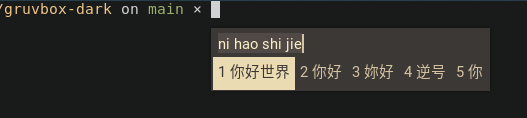

# fcitx5 gruvbox theme

A minimal fcitx5 color theme based on [Gruvbox](https://github.com/morhetz/gruvbox)

## Screenshot



## Installation

```sh
git clone https://github.com/c25vdw/fcitx5-gruvbox
mkdir -p ~/.local/share/fcitx5/themes/
cd fcitx5-gruvbox
cp -r gruvbox-dark/ ~/.local/share/fcitx5/themes/
```

## Usage

- Option1: edit config file

    ```dosini
    # ~/.config/fcitx5/conf/classicui.conf
    Theme=gruvbox-dark
    ```

    ```sh
    # restart fcitx5
    fcitx5 -r
    ```

- Option2: use GUI

    [see how in this tweet](https://twitter.com/felixonmars/status/1344335122787573760) ([archived](http://web.archive.org/web/20201231172830/https://twitter.com/felixonmars/status/1344335122787573760))

